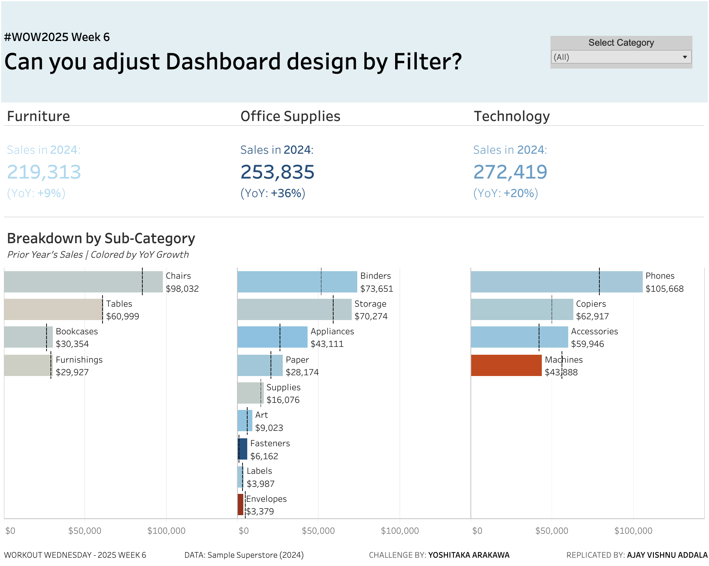

# Workout Wednesday 2025 | Week 6 | Adjust Dashboard Design by Filter

## Challenge Overview
This challenge focuses on creating a dynamic and exploratory Tableau dashboard that adapts to user interactions, specifically filter selections. By dynamically changing the displayed charts based on filter conditions, we aim to enhance user experience and reduce navigation complexity.

### Requirements
1. Display the total Sales in 2024 and the year-over-year (YoY) growth rate by Category.
2. Create bullet charts comparing Sales in 2024 (bar charts) and 2023 (dashed lines) by Sub-Category.
3. Add a Category filter.
4. Display the bullet chart by product name only if **not all** of the Categories are selected in the filter.
5. Color all of the charts based on their YoY.
6. Match tooltips and formatting as closely as possible.

### Dataset
This challenge uses the Sample Superstore dataset (2024 version) available on [Data.World](https://data.world/).

---

## Steps to Build the Dashboard

### 1. Data Preparation
- Download the Sample Superstore dataset (2024 version).
- Connect the dataset to Tableau.

### 2. Build the Views
#### A. Total Sales and YoY by Category
- Create a calculated field for YoY growth rate:
  ```
  YoY Growth = (SUM([Sales 2024]) - SUM([Sales 2023])) / SUM([Sales 2023])
  ```
- Create a bar chart showing total Sales by Category for 2024.
- Add YoY as a color measure to visually represent performance.

#### B. Bullet Charts by Sub-Category
- Build a bullet chart:
  - Bar chart for 2024 Sales.
  - Reference line for 2023 Sales (using a dashed line style).
- Add YoY as the color measure.

#### C. Conditional Bullet Chart by Product Name
- Create a calculated field to check filter conditions:
  ```
  Display Product View = IIF(COUNTD([Category]) < TOTAL(COUNTD([Category])), "Show", "Hide")
  ```
- Use this field to toggle between Sub-Category and Product Name bullet charts.

### 3. Filters and Interactivity
- Add a Category filter to the dashboard.
- Ensure interactivity by dynamically toggling between Sub-Category and Product Name views based on the filter selection.

### 4. Formatting and Tooltips
- Match formatting and tooltips across all charts:
  - Display YoY growth with percentage formatting.
  - Use consistent fonts, sizes, and alignments.

### 5. Final Touches
- Add dynamic titles to indicate the current filter selection.
- Ensure the dashboard is intuitive and visually appealing.

---

## Dashboard Preview


[View the Interactive Dashboard on Tableau Public](https://public.tableau.com/views/AdjustDashboarddesignbyFilterWOW2025W6/WOW2025W6?:language=en-US&:sid=&:redirect=auth&:display_count=n&:origin=viz_share_link)

---

## Inspiration
This dashboard design was inspired by Yoshitaka Arakawa’s Workout Wednesday 2025, Week 6 challenge. [Original Challenge Details](https://www.workout-wednesday.com/).
